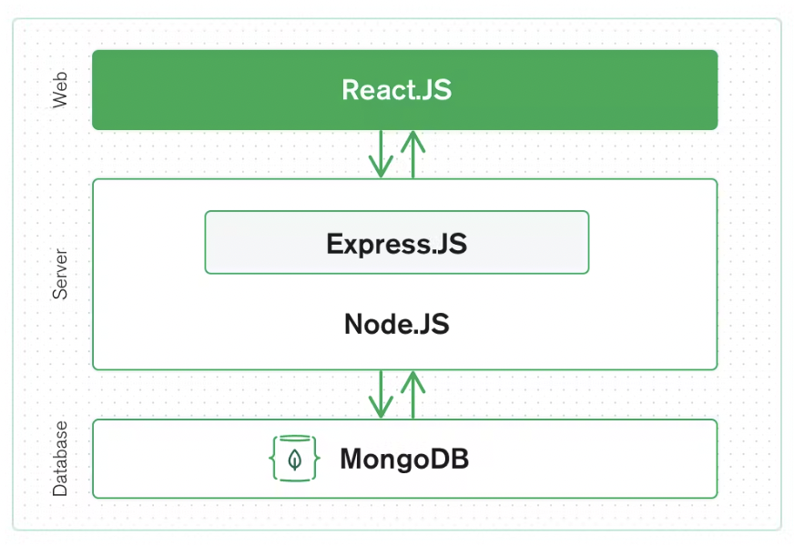

# course-project-blogengine

The Inkwell: A Blog Engine Web Server

Summary:
- A tool that people can use to create multiple blog posts within the same shared space, as opposed to individual blogging websites
- Users can create, preview, or view blog posts as well as resize images (through Markdown)

Technical Architecture:

Installation: 
1. Clone the repository to your local machine.
2. Run `npm install` to install the necessary dependencies.
3. Navigate to the react-app folder, and run the website using `npm start`.
4. Access the web application at `http://localhost:3000`.

Group members/roles:

- Amy: Used React, JS, HTML/CSS, and Bootstrap to work on the frontend/web server, as well as Express, NodeJS, MongoDB and Mongoose for the server functionality and building the database, respectively. Wrote project proposal with Sakshi.

- Sakshi: Used HTML/CSS and JSX to work on the frontend portion of the website: formatted and added stylistic components to it (familiarized herself with JSX since it was integrated with the other languages and affected the formatting). Wrote project proposal with Amy. 

- Aniketh: Used HTML/CSS/JSX/React to work on frontend portion of website, as well as used MongoDB and Mongoose for the database.

- Aakarsh: Used HTML/CSS/JSX/React to work on frontend portion of website, as well as used MongoDB and Mongoose for the database.
